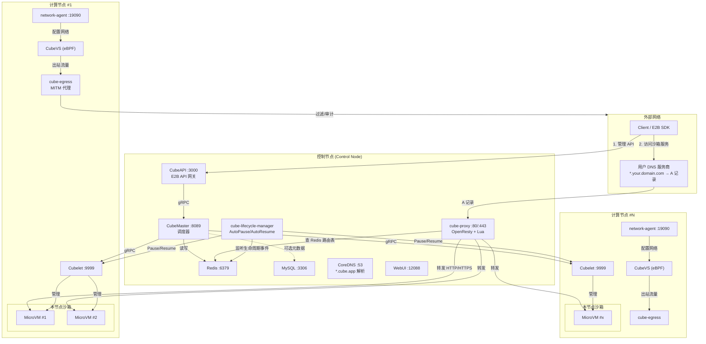
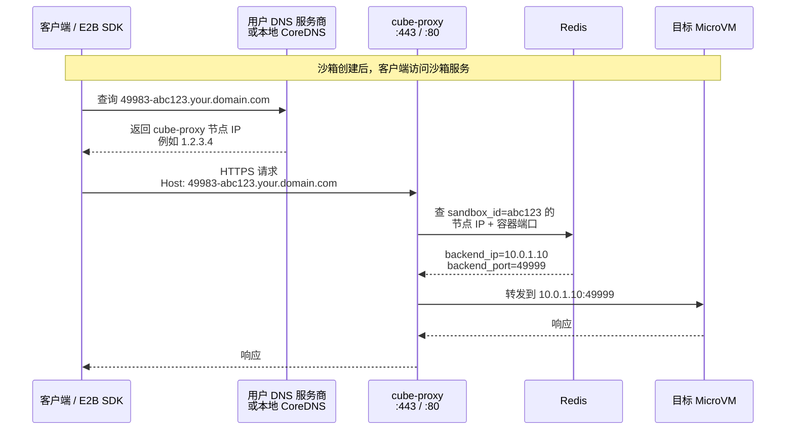
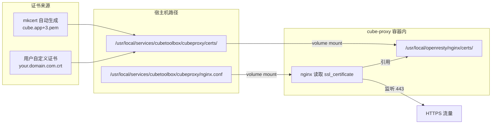
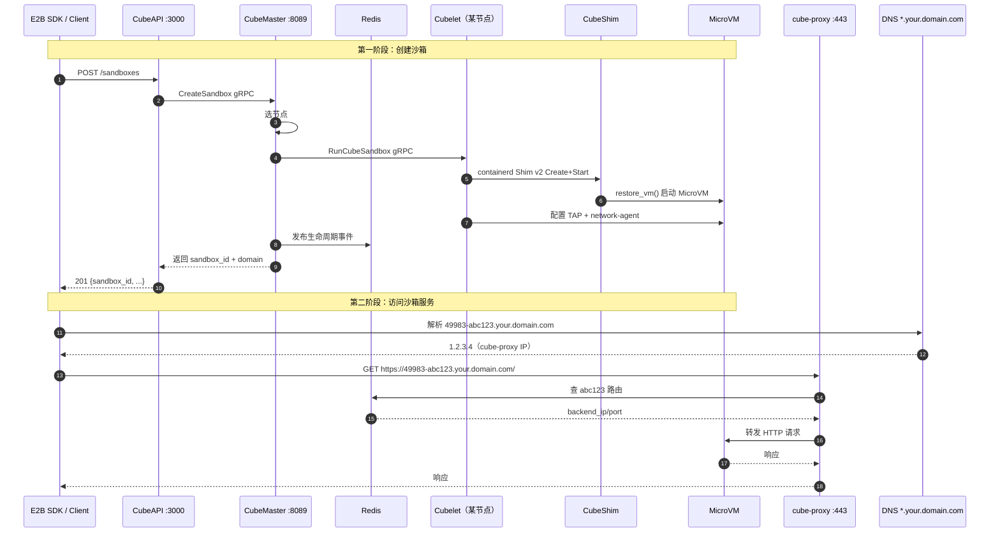

# CubeSandbox 部署架构图

> 本文档描述 CubeSandbox one-click / 多节点部署下的整体架构、服务关系、请求流转，以及 wildcard DNS 与 HTTPS 证书的工作方式。

---

## 1. 整体部署架构（控制节点 + 计算节点）

### 部署方式说明

| 节点 | 服务 | 部署方式 | 说明 |
|------|------|----------|------|
| 控制节点 | CubeAPI、CubeMaster | systemd + 本地二进制 | 自研控制面，无状态 |
| 控制节点 | Redis、MySQL | systemd + Docker 容器 | 第三方依赖 |
| 控制节点 | cube-proxy、CoreDNS、WebUI、cube-lifecycle-manager | systemd + Docker 容器 | 网关/DNS/控制台/生命周期管理 |
| 控制/计算节点 | network-agent、cubelet | systemd + 本地二进制 | 节点数据面核心 |
| 控制/计算节点 | cube-egress | systemd + Docker 容器 (`--network=host`) | 透明 MITM 代理 |

---

## 2. Wildcard DNS 解析特写

### Wildcard DNS 字段含义

| 字段 | 示例 | 含义 |
|------|------|------|
| `49983` | `49983-abc123.your.domain.com` | cube-proxy 对外暴露的访问端口 |
| `abc123` | `49983-abc123.your.domain.com` | sandbox ID，由 CubeMaster 分配 |
| `your.domain.com` | `49983-abc123.your.domain.com` | 用户配置的 base domain |
| `*.your.domain.com` | wildcard A 记录 | 全部解析到 cube-proxy 所在节点 IP |

### one-click 快速体验 vs 生产部署

| 场景 | DNS 配置位置 | 说明 |
|------|--------------|------|
| one-click 快速体验 | CoreDNS + 宿主机 DNS 路由 | 控制节点本机启动 CoreDNS，`*.cube.app` 解析到本机 IP |
| 生产部署 | 用户自己的 DNS 服务商 | 配置 `*.your.domain.com → <cube-proxy IP>` |

---

## 3. HTTPS 证书路径

### 证书配置方式

| 方式 | 配置入口 | 适用场景 |
|------|----------|----------|
| 自动生成 | `mkcert cube.app "*.cube.app"` | one-click 本地体验 |
| 自定义证书 | `.env` 中 `CUBE_PROXY_SSL_CERT_SRC` / `CUBE_PROXY_SSL_KEY_SRC` | 生产环境 |
| 手动替换 | 直接放到 `/usr/local/services/cubetoolbox/cubeproxy/certs/` | 临时调试 |

---

## 4. 完整请求生命周期

---

## 5. 核心组件关系速查

| 组件 | 角色 | 直接交互对象 |
|------|------|--------------|
| **CubeAPI** | E2B 兼容 API 网关 | Client、CubeMaster |
| **CubeMaster** | 集群调度器 | CubeAPI、Redis、Cubelet |
| **cube-lifecycle-manager** | 自动暂停/恢复管家 | Redis、CubeProxy、Cubelet |
| **cube-proxy** | 流量入口/路由网关 | Client、Redis、MicroVM、CLM |
| **network-agent** | 节点网络配置器 | Cubelet、CubeVS、cube-egress |
| **cube-egress** | 出站流量安检门 | CubeVS、外部网络 |

---

## 6. 一句话总结

> 客户端先通过 **CubeAPI** 创建沙箱，拿到 `49983-abc123.your.domain.com` 这样的域名；然后客户端向 DNS 查询这个域名，DNS 的 wildcard 记录 `*.your.domain.com` 把它解析到 **cube-proxy** 的 IP；cube-proxy 根据 Host 头里的 sandbox ID 去 **Redis** 查真实后端，最后把请求转发到对应节点上的 **MicroVM**。
