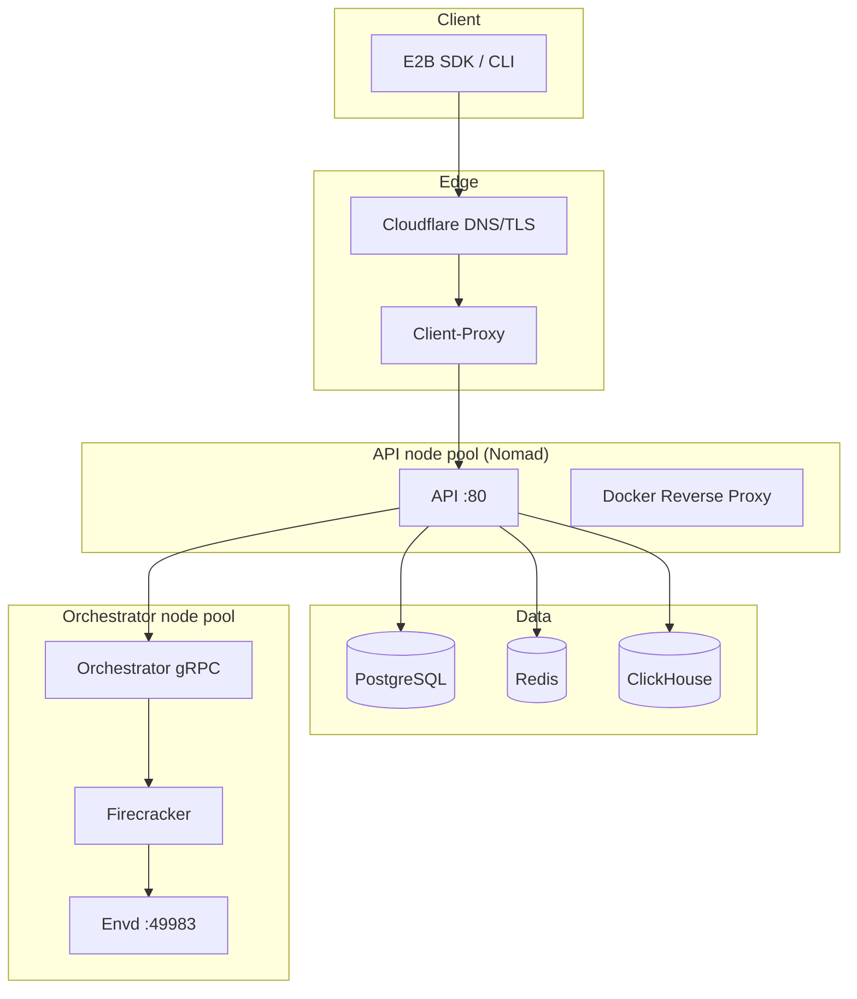
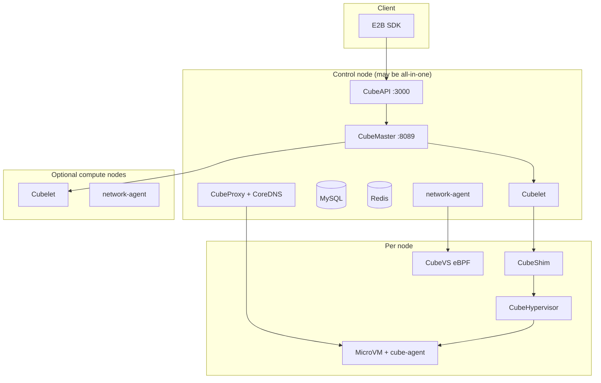
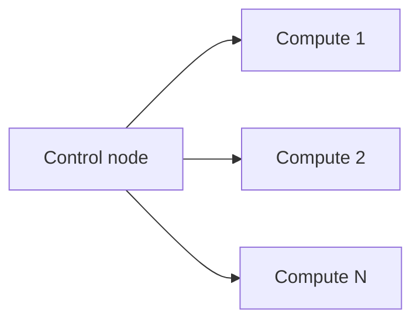

# 02 — Architecture Comparison

## Request path: client to sandbox

### E2B Infrastructure

**Characteristics**

- **Nomad + Consul** schedule and discover services.
- **Orchestrator** runs as a `system` job on dedicated nodes with static ports for gRPC and proxy.
- **Templates and kernels** live in object storage (GCS/S3); NFS/Filestore used for chunk cache on GCP.
- **Observability** is first-class: OTEL, Loki, Mimir, optional Grafana Cloud.

### CubeSandbox

**Characteristics**

- **No Nomad** — control plane is CubeMaster + host processes.
- **CubeProxy** terminates TLS and routes by Host header pattern.
- **CubeVS** enforces network policy in kernel (TC/XDP eBPF), not iptables-only on orchestrator.

---

## Component mapping

| Concern | E2B Infra | CubeSandbox |
|---------|-----------|-------------|
| Public API | `packages/api` | `cube-api` (CubeAPI) |
| Scheduling | Nomad + orchestrator placement | CubeMaster |
| Node agent | Orchestrator (raw_exec) | Cubelet |
| Hypervisor | Firecracker | CubeHypervisor (KVM / `KvmPvm`) |
| Runtime shim | — | CubeShim (containerd v2) |
| In-guest daemon | Envd | cube-agent |
| Edge / sandbox URL | client-proxy | CubeProxy |
| Service discovery | Consul | CubeMaster `/internal/meta` |
| Network policy | Orchestrator netlink/iptables | CubeVS + network-agent |
| DB | PostgreSQL | MySQL |
| Template build | template-manager job | `cubemastercli tpl create-from-image` |
| IaC | Terraform + Packer | `deploy/one-click` scripts |

---

## Virtualization design

### Firecracker (E2B)

- Mature microVM VMM; minimal device model.
- Requires **KVM** on host → typically **bare metal** or **nested virt** cloud instances.
- Kernel/rootfs versions pinned in `packages/fc-versions/` and buckets.

### KVM + CubeHypervisor (Cube)

- RustVMM-derived stack; integrates via **containerd shim**.
- **Native KVM**: bare metal, physical, some cloud VMs with `/dev/kvm`.
- **PVM** (`kvm_pvm`): page-table nested virtualization when cloud blocks VT-x passthrough; uses guest kernel `vmlinux-pvm` when `CUBE_PVM_ENABLE=1`.

See [05 — Runtime environment & performance](./05-runtime-environment-performance.md).

---

## Network architecture (CubeVS summary)

CubeVS replaces bridge/OVS-heavy paths with three BPF programs:

| Program | Attach | Role |
|---------|--------|------|
| `from_cube` | TC ingress on TAP | SNAT, egress policy, sessions |
| `from_world` | TC ingress on NIC | Reverse NAT, port mapping |
| `from_envoy` | TC egress on cube-dev | Overlay DNAT to sandbox |

E2B orchestrator networking is Linux netlink/iptables oriented on orchestrator nodes. Both achieve per-sandbox isolation; CubeVS optimizes for **many tenants per host** and kernel-side policy.

---

## Data and state

### E2B

- **Authoritative**: PostgreSQL (users, teams, sandboxes metadata).
- **Redis**: caching, pub/sub style coordination.
- **ClickHouse**: analytics and operational queries.
- **Object storage**: templates, kernels, build artifacts.

### CubeSandbox

- **MySQL**: templates, sandboxes, cluster metadata (schema under `deploy/one-click/sql/`).
- **Redis**: coordination/cache.
- **Local paths**: `/usr/local/services/cubetoolbox` (default), `/data/cubelet` for runtime data.

---

## Scaling model

### E2B (horizontal)

Add **orchestrator node pool** capacity via Terraform ASG/MIG; API and edge scale on **api node pool**. Build workloads isolated on **build node pool**. ClickHouse optional dedicated pool.

### CubeSandbox (horizontal)

- **Control node**: CubeMaster, API, DB, proxy (one logical cluster).
- **Compute nodes**: `install-compute.sh`, `ONE_CLICK_DEPLOY_ROLE=compute`, register via CubeMaster `:8089`.

---

## Security model comparison

| Layer | E2B | Cube |
|-------|-----|------|
| VM boundary | Firecracker | KVM microVM |
| Kernel | Dedicated per sandbox | Dedicated per sandbox |
| Network | Orchestrator rules | CubeVS allow/deny LPM, port maps |
| API auth | Supabase JWT | Configurable; dev uses placeholder key |
| Secrets | GCP/AWS Secrets Manager | `.env`, mkcert locally; prod BYO |

---

## Operational complexity

| Aspect | E2B Infra | CubeSandbox |
|--------|-----------|-------------|
| Initial setup time | Days (cloud, DNS, secrets) | Minutes (one-click) to hours (self-build) |
| Moving parts | Many Nomad jobs | Fewer processes; Docker only for DB/proxy |
| Upgrade path | `make build-and-upload` + Nomad rollout | Replace bundle / reinstall |
| Debug SSH | `make connect-orchestrator` | Host logs under cubetoolbox paths |

---

## Further reading

- Official: [Architecture overview](../architecture/overview.md), [Network (CubeVS)](../architecture/network.md)
- E2B: `infra/CLAUDE.md`, `infra/self-host.md`
- [03 — CubeSandbox deployment](./03-cubesandbox-deployment-guide.md)
- [04 — E2B Infra deployment](./04-e2b-infra-deployment-guide.md)
