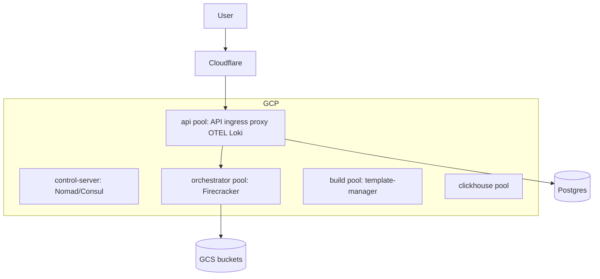

# 04 — E2B Infrastructure Deployment Guide

Reference for self-hosting **[E2B Infrastructure](https://github.com/e2b-dev/infra)** alongside CubeSandbox evaluations. Source of truth: `infra/self-host.md` and `infra/CLAUDE.md`.

CubeSandbox operators may use this document to understand what a **full E2B cloud** requires vs a **Cube one-click** install.

---

## What gets deployed

### Service layer (Nomad jobs)

| Job / service | Role |
|---------------|------|
| **api** | REST API, auth, OpenAPI handlers |
| **orchestrator** | Firecracker VM lifecycle (system job on client pool) |
| **client-proxy** | Edge request routing |
| **template-manager** | Build sandbox templates |
| **docker-reverse-proxy** | Build-time Docker access |
| **clickhouse** | Analytics |
| **loki**, **otel-collector**, **logs-collector** | Observability |
| **ingress** (Traefik) | HTTP ingress on API pool |
| **dashboard-api** | Optional dashboard backend |

### Data stores

| Store | Usage |
|-------|--------|
| **PostgreSQL** | Primary metadata (Supabase documented) |
| **Redis** | Cache / coordination |
| **ClickHouse** | Analytics |
| **GCS / S3** | Kernels, Firecracker builds, templates |

---

## Supported clouds

| Provider | Status | Notes |
|----------|--------|-------|
| **GCP** | Production-ready | Primary documented path |
| **AWS** | Beta | Bare-metal-capable instance types for orchestrator pool |
| Azure | Planned | — |
| Generic Linux | Planned | — |

---

## Prerequisites

### Tools

| Tool | Version / note |
|------|----------------|
| Terraform | **v1.5.x** (MPL license; avoid 1.6+ BSL if license matters) |
| Packer | Orchestrator node disk image |
| Go | Match `go.work` |
| Docker + **buildx** | `make build-and-upload` |
| NPM | Frontend/dashboard assets |
| gcloud / aws cli | Per provider |

### Accounts and services

| Item | Required |
|------|----------|
| **Cloudflare** account + domain | DNS + TLS |
| **PostgreSQL** connection string | Required (Supabase in docs) |
| Supabase JWT secret | Optional; needed for [E2B dashboard](https://github.com/e2b-dev/dashboard) |
| Grafana / PostHog | Optional monitoring |

### GCP quotas (example)

- Persistent Disk SSD ≥ **2500 GB**
- CPUs ≥ **24**
- Enable APIs via `make init` (Secret Manager, Compute, Artifact Registry, Filestore, etc.)

---

## GCP deployment flow

| Step | Command / action |
|------|------------------|
| 1 | Create GCP project; copy `.env.gcp.template` → `.env.prod` (or staging/dev) |
| 2 | `make switch-env ENV=prod` |
| 3 | `make provider-login` |
| 4 | `make init` (retry once if API enable race) |
| 5 | `make build-and-upload` |
| 6 | `make copy-public-builds` (kernels, FC, busybox to your bucket) |
| 7 | Fill **GCP Secrets Manager**: Cloudflare token, Postgres (**required**), optional JWT/PostHog |
| 8 | `make plan-without-jobs` → `make apply` |
| 9 | Wait for TLS certificates |
| 10 | `make plan` → `make apply` (Nomad jobs + DB migrations via api db-migrator) |
| 11 | `make prep-cluster` (user, team, base template) |

### GCP node pools (logical)



Typical variables: `api_node_pool`, `orchestrator_node_pool`, `build_node_pool`, `clickhouse_node_pool`, `loki_node_pool`.

---

## AWS deployment flow (beta)

| Step | Command / action |
|------|------------------|
| 1 | `.env.template` with `PROVIDER=aws`, region, `PREFIX`, domain |
| 2 | `make switch-env` + `make provider-login` (ECR) |
| 3 | `make init` |
| 4 | Secrets in **AWS Secrets Manager** |
| 5 | Packer AMI: `iac/provider-aws/nomad-cluster-disk-image` |
| 6 | `make build-and-upload`, `make copy-public-builds` |
| 7 | `make plan-without-jobs` → `apply` → `plan` → `apply` |
| 8 | `make prep-cluster` |

### AWS node pools

| Pool | Default role |
|------|----------------|
| **control-server** | Nomad/Consul servers (~3× t3.medium) |
| **api** | API, ingress, client-proxy, telemetry (~t3.xlarge) |
| **client** | Orchestrator / Firecracker (**m8i.4xlarge** class) |
| **build** | Template builds (~m8i.2xlarge) |
| **clickhouse** | Analytics (~t3.xlarge) |

**Critical**: Firecracker needs **bare metal or nested virtualization**. Request quota for chosen instance types in region.

Optional: `REDIS_MANAGED=true` for ElastiCache.

---

## Makefile cheat sheet

| Target | Purpose |
|--------|---------|
| `make init` | Terraform backend + providers |
| `make plan` / `apply` | Full stack including Nomad jobs |
| `make plan-without-jobs` | Infra only |
| `make plan-only-jobs` | Nomad jobs only |
| `make build-and-upload` | Images + binaries + disk image |
| `make copy-public-builds` | Seed kernels/FC from public bucket |
| `make prep-cluster` | Initial user/team/template |
| `make destroy` | Tear down |
| `make connect-orchestrator` | SSH for debugging |

---

## Client configuration

### SDK domain

```javascript
import { Sandbox } from "e2b";
const sandbox = await Sandbox.create({ domain: "<your-domain>" });
```

```python
from e2b import Sandbox
sandbox = Sandbox.create(domain="<your-domain>")
```

### CLI

```bash
E2B_DOMAIN=<your-domain> e2b <command>
```

---

## Architecture requirements summary

| Requirement | Detail |
|-------------|--------|
| DNS | Cloudflare-managed domain |
| TLS | Certificate Manager (GCP) / ACM + Cloudflare (AWS) |
| Orchestrator nodes | KVM-capable (**bare metal** preferred) |
| Storage | Object storage + optional NFS/Filestore (GCP) for cache |
| State | Remote Terraform state (GCS/S3) |
| Secrets | Cloud secret manager, not plain `.env` in prod |

---

## E2B vs CubeSandbox deployment effort

| Aspect | E2B Infra | CubeSandbox |
|--------|-----------|-------------|
| Time to first sandbox | Hours–days | Minutes |
| Minimum footprint | Multi-pool cluster | Single host |
| IaC | Terraform required | Shell + optional bundle build |
| External deps | Cloudflare + Postgres + cloud | Docker Hub/mirrors; MySQL local |
| Cost entry | High (multi nodes + disks) | Low (one cloud VM with PVM) |

---

## When to choose E2B Infra self-host

- You need **parity with e2b.dev** product features (teams, billing hooks, dashboard).
- You are already on **GCP/AWS** with Terraform ops maturity.
- You want **Firecracker** specifically and Nomad-based ops.
- You accept **multi-node minimum** for production.

When you need **faster private Agent runtime** with E2B SDK compatibility on a **single machine or PVM cloud VM**, see [03 — CubeSandbox deployment](./03-cubesandbox-deployment-guide.md).

---

## References

- Upstream: https://github.com/e2b-dev/infra/blob/main/self-host.md
- Workspace copy: `infra/README.md`, `infra/CLAUDE.md`
