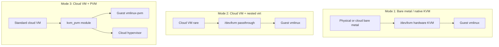

# 05 — Runtime Environment & Performance

How **host environment** (bare metal vs cloud VM vs PVM) affects CubeSandbox performance, and how that compares to E2B Infra hosting requirements.

---

## Three host modes for CubeSandbox



| Mode | `/dev/kvm` | Install flag | Official perf claims |
|------|------------|--------------|----------------------|
| **1 — Bare metal** | Hardware KVM | `CUBE_PVM_ENABLE=0` (default) | **Yes** — README benchmarks |
| **2 — Nested KVM** | Host exposes VT-x | Default guest kernel | Not separately benchmarked in repo |
| **3 — PVM cloud VM** | Via `kvm_pvm` | `CUBE_PVM_ENABLE=1` | Reliability at scale; **no public latency table vs mode 1** |

---

## Published CubeSandbox benchmarks (Mode 1)

From project README — **bare metal**:

| Metric | Value |
|--------|-------|
| Cold start (1 concurrent) | ~**60ms** |
| Cold start (50 concurrent) | avg ~**67ms**, P95 ~**90ms**, P99 ~**137ms** |
| Memory overhead (sandbox spec ≤ 32GB) | **&lt;5MB** beyond spec |
| Density | Thousands per node (bare metal, CoW snapshots) |

Footnote in README: larger sandbox specs may increase overhead slightly.

**Implication for Mode 3**: Treat sub-100ms create latency as a **target to validate**, not a guarantee on PVM + standard CVM.

---

## Performance impact by dimension

### 1. Sandbox create/delete API latency

Dominated by: snapshot clone, Cubelet scheduling, network-agent TAP setup, CubeVS map updates.

| Factor | Mode 1 | Mode 3 (PVM) |
|--------|--------|----------------|
| VM exit / page table work | Lower | Higher (shadow paging) |
| Host CPU steal | Minimal on BM | Common on shared cloud |
| Disk | Local NVMe best | Cloud disk IOPS caps |
| **Expectation** | Matches README charts | **Slower P50/P99** — measure with cube-bench |

### 2. In-sandbox CPU workloads

Agent code execution, compilers, ML training:

| Factor | Mode 1 | Mode 3 |
|--------|--------|--------|
| Nested virtualization tax | None | **~5–25%+** typical range for CPU-heavy work (workload-dependent) |
| vCPU pinning | Full socket on BM | Shared tenancy |

**Recommendation**: RL, SWE-Bench farms, long CPU jobs → **Mode 1** (bare metal or cloud bare metal).

### 3. Memory and density

Per-sandbox **&lt;5MB** overhead model applies to guest design; **host capacity** differs:

| Factor | Mode 1 | Mode 3 |
|--------|--------|--------|
| Effective RAM for sandboxes | Higher | Lower (hypervisor + PVM metadata) |
| Max sandboxes per host | Highest | Reduced — load test before promising count |

### 4. Network (CubeVS)

CubeVS behavior is **the same** across modes. End-to-end throughput still limited by:

- Cloud NIC bandwidth / PPS limits
- Security group rules
- SNAT port pools on busy hosts

### 5. Storage I/O

Template import, writable CoW layers, guest image reads:

- Bare metal NVMe → best template build and burst I/O
- Cloud SSD → watch IOPS provisioning and `/data/cubelet` on separate volume

---

## PVM technical summary

**PVM** (Pagetable-based Virtual Machine): nested virtualization without requiring the **cloud hypervisor** to expose Intel VT-x/AMD-V to your VM. Uses shared memory + shadow page tables in the PVM host kernel (`cube.pvm.host`) and PVM guest kernel (`vmlinux-pvm`).

- Paper: [PVM: Efficient Shadow Paging (ACM)](https://dl.acm.org/doi/10.1145/3600006.3613158)
- Production: Tencent Cloud at scale (per project docs)
- Install: [PVM deployment guide](../guide/pvm-deploy.md)

**Why use PVM**: Ordinary cloud VM **without** `/dev/kvm` — Cube cannot run standard KVM path.

**Cost**: Additional virtualization layer vs Mode 1.

---

## Mode 2 — Nested KVM on cloud

Some providers enable nested virtualization; `ls /dev/kvm` works inside your VM.

| vs Mode 1 | vs Mode 3 |
|-----------|-----------|
| Extra VMExit layer | Often better than PVM when KVM is native to guest |
| Provider-dependent | PVM works when nested KVM is **disabled** |

If Mode 2 is available, benchmark both Mode 2 and Mode 3 on the same SKU.

---

## Comparison table: hosting for AI Agent sandboxes

| | Cube Mode 1 | Cube Mode 3 (PVM) | E2B orchestrator pool |
|--|-------------|-------------------|------------------------|
| **Host** | Bare metal / BM cloud | Standard CVM/EC2 | BM / nested virt |
| **VMM** | CubeHypervisor KVM | CubeHypervisor KvmPvm | Firecracker |
| **Advertised cold start** | ~60ms BM | Not published | Pool-based (seconds class) |
| **Cloud VM without KVM** | No | **Yes** | No |
| **Deploy complexity** | Medium | Low (one-click) | High (Terraform) |
| **Isolation** | Guest kernel + CubeVS | Same | Firecracker + orchestrator net |

---

## Benchmarking procedure

Use project tool [`examples/cube-bench`](https://github.com/tencentcloud/CubeSandbox/tree/master/examples/cube-bench):

```bash
export E2B_API_URL=http://<host>:3000
export E2B_API_KEY=dummy
export CUBE_TEMPLATE_ID=<template-id>

cd examples/cube-bench && make
./bin/cube-bench -c 20 -n 200 -o report-bm.json
```

Compare on **same template** and **same concurrency**:

| Report field | Decision use |
|--------------|--------------|
| P50 / P95 / P99 create | SLA for Agent burst |
| Error rate | Stability under load |
| create-only vs create-delete | Pool exhaustion |

Run separately on:

1. Bare metal (Mode 1)
2. PVM cloud VM (Mode 3) — same vCPU/RAM tier if possible

---

## Sizing guidelines (indicative)

| Workload | Mode | Instance hint |
|----------|------|----------------|
| Dev / POC | 3 | 4 vCPU, 8 GB RAM |
| Production Agent (light) | 3 or 1 | 8+ vCPU, 16+ GB; dedicated `/data` disk |
| High create QPS | 1 | Bare metal; cube-bench validate |
| RL / heavy CPU | 1 | Bare metal; avoid Mode 3 |
| Max sandboxes / node | 1 | Max RAM + fast disk; empirical cap |

**Rule of thumb**: Plan RAM as `(count × (sandbox_mem_limit + overhead)) + 4–8 GB` for control plane and host — measure real usage.

---

## Scenario recommendations

| Scenario | Recommended mode |
|----------|------------------|
| Tencent / generic cloud CVM, no KVM | **Mode 3** + `CUBE_PVM_ENABLE=1` |
| Owned physical servers | **Mode 1** |
| Cost-sensitive production Agents | **Mode 3** if SLA OK after bench; else **Mode 1** |
| Need README-grade latency SLA | **Mode 1** only with proof via cube-bench |
| Laptop dev | `dev-env` QEMU, not Mode 3 prod |

---

## Common mistakes

| Mistake | Effect |
|---------|--------|
| Install without `CUBE_PVM_ENABLE=1` on KVM-less cloud | Sandboxes fail or no KVM |
| `.env` has `CUBE_PVM_ENABLE=0` | Overrides shell; PVM silently off |
| Expect 60ms on 2 vCPU burstable CVM | Misaligned expectations |
| No separate `/data/cubelet` disk | IOPS throttle under load |
| Skip cube-bench before production SLA | P99 surprises |

---

## Related

- [03 — CubeSandbox deployment](./03-cubesandbox-deployment-guide.md)
- [01 — Comparison overview](./01-comparison-overview.md)
- Official: [PVM deploy](../guide/pvm-deploy.md), [Bare-metal deploy](../guide/bare-metal-deploy.md)
