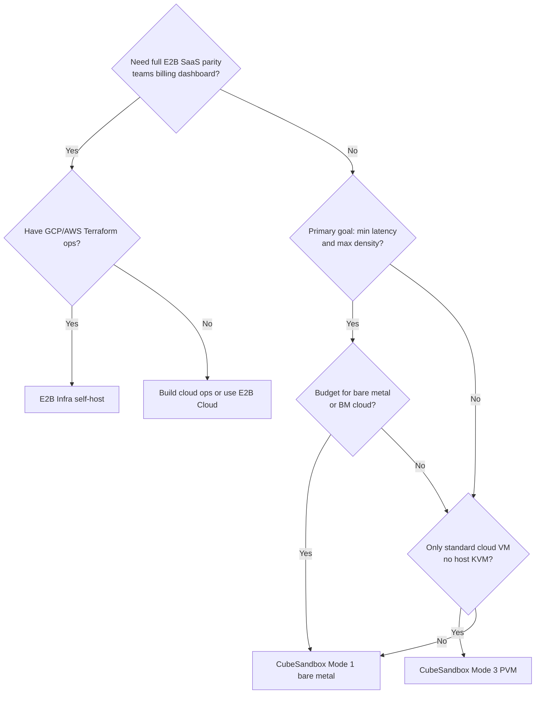

# 06 — Selection, Migration & Coexistence

Decision guide for teams choosing **CubeSandbox**, **E2B Infrastructure self-host**, or **E2B Cloud**, and how to migrate between API-compatible endpoints.

---

## Decision flowchart



---

## Selection matrix

| Your priority | Recommended stack |
|---------------|-------------------|
| Fastest path to private sandboxes, E2B SDK | **CubeSandbox** one-click |
| Ordinary cloud VM (Alibaba/Tencent/AWS CVM) | **CubeSandbox PVM** |
| Match e2b.dev control plane & analytics | **E2B Infra** on GCP/AWS |
| Sub-100ms create at high concurrency | **Cube bare metal** + cube-bench proof |
| Lowest ops moving parts | **CubeSandbox** single node |
| Enterprise cloud IaC + Nomad already | **E2B Infra** |
| No ops at all | **E2B Cloud** (hosted) |

---

## CubeSandbox vs E2B Infra self-host

| Criterion | Prefer CubeSandbox | Prefer E2B Infra |
|-----------|-------------------|------------------|
| Time to first sandbox | ✓ minutes | |
| Single-node / edge | ✓ | |
| PVM on generic VM | ✓ | |
| Firecracker ecosystem | | ✓ |
| Postgres + Supabase auth story | | ✓ |
| ClickHouse analytics built-in | | ✓ |
| Nomad multi-pool maturity | | ✓ |
| Advertised ms-level create (BM) | ✓ | |
| Terraform/GitOps standard | | ✓ |

---

## Migration: E2B Cloud → CubeSandbox

CubeSandbox targets **API compatibility** with the E2B SDK, not database or template ID portability.

### Steps

1. Deploy CubeSandbox ([03 — Deployment guide](./03-cubesandbox-deployment-guide.md)).
2. Recreate templates (`cubemastercli tpl create-from-image` or import equivalent OCI image).
3. Point clients:

```bash
export E2B_API_URL=http://<cube-host>:3000
export E2B_API_KEY=dummy   # or configured key
export CUBE_TEMPLATE_ID=<new-template-id>
export SSL_CERT_FILE=/path/to/mkcert-rootCA.pem   # if using CubeProxy TLS
```

4. Run integration tests (create, run_code, files, ports).
5. Benchmark if latency SLA matters ([05 — Performance](./05-runtime-environment-performance.md)).

### Code changes

Usually **none** in Agent logic if using official E2B SDK — only env vars / domain.

### Not migrated automatically

| Item | Action |
|------|--------|
| E2B template IDs | Rebuild on Cube |
| E2B team/user DB | Re-implement or sync |
| Historical analytics | Separate export from ClickHouse |
| Custom Envd behavior | Map to cube-agent capabilities |

---

## Migration: CubeSandbox → E2B Infra

1. Stand up E2B Infra per [04 — E2B deployment](./04-e2b-infra-deployment-guide.md).
2. `make prep-cluster`; build templates in E2B pipeline.
3. Update SDK:

```bash
export E2B_DOMAIN=<your-e2b-domain>
unset E2B_API_URL   # SDK uses domain for cloud pattern
# Use real API keys from E2B auth
```

4. Re-test port exposure and sandbox URLs (`<port>-<id>.<domain>` vs `cube.app`).

---

## Migration: bare metal → PVM cloud (or reverse)

### To PVM (downgrade host capability, keep cluster)

1. Install PVM host kernel; reboot; `modprobe kvm_pvm`.
2. Set `CUBE_PVM_ENABLE=1` and reinstall guest kernel per [PVM guide](../guide/pvm-deploy.md).
3. Re-run cube-bench; adjust SLA and instance size.

### To bare metal (upgrade)

1. Provision BM; install without PVM flag.
2. Export MySQL if needed; or rebuild cluster.
3. Shift DNS / `E2B_API_URL` to new control node.

---

## Running both stacks

| Pattern | Use case |
|---------|----------|
| **Dev on Cube, prod on E2B Cloud** | Cost / speed in dev |
| **Burst on Cube BM, control on E2B** | Rare; requires two SDK endpoints and template parity |
| **Sidecar dev** | [`examples/e2b-dev-sidecar`](../guide/connect-existing-cluster.md) — local DNS to remote Cube |

Avoid splitting one logical “environment” across two backends without explicit routing in your Agent platform.

---

## Risk register

| Risk | Mitigation |
|------|------------|
| Assuming PVM = bare metal latency | cube-bench on target SKU |
| E2B orchestrator on non-KVM VM | Use correct instance type or switch to Cube PVM path |
| Secret `dummy` API key in prod | Enable [authentication](../guide/authentication.md) |
| Template drift between stacks | CI template build for both if dual-running |
| Cube on undersized disk | XFS volume for `/data/cubelet` |

---

## Checklist: pick and prove

- [ ] Documented primary SLA (create P99, concurrent sandboxes)
- [ ] Chosen host mode (1 / 2 / 3) per [05](./05-runtime-environment-performance.md)
- [ ] Chosen product (Cube vs E2B Infra vs hosted E2B)
- [ ] Template strategy on target stack
- [ ] cube-bench or integration test results archived
- [ ] Auth/TLS plan for production
- [ ] Runbook for compute node add/remove (if Cube multi-node)

---

## Document map

| Question | Read |
|----------|------|
| What are the products? | [01](./01-comparison-overview.md) |
| How do components map? | [02](./02-architecture-comparison.md) |
| How do I install Cube? | [03](./03-cubesandbox-deployment-guide.md) |
| How do I install E2B? | [04](./04-e2b-infra-deployment-guide.md) |
| Bare metal vs PVM? | [05](./05-runtime-environment-performance.md) |
| Which should we buy/build? | This document |
| On-prem DC + Kubernetes background? | [07](./07-on-prem-and-kubernetes.md) |
