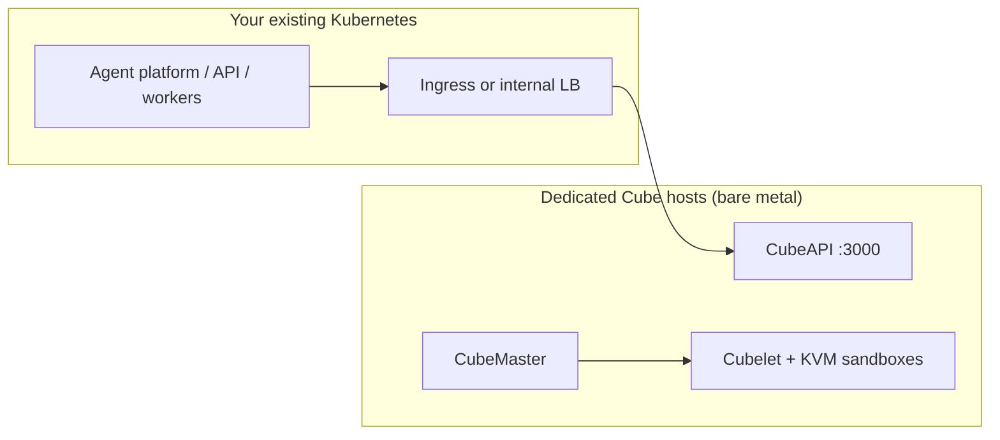

# 07 — On-Premises Datacenter & Kubernetes Experience

Guidance for teams with **Kubernetes experience** deploying sandboxes in a **private datacenter** (on-premises bare metal or rack servers).

---

## Recommendation (short answer)

**Prefer CubeSandbox in bare-metal Mode 1 (native KVM)** for private datacenter deployments.

Choose **E2B Infrastructure** only if you must replicate the **full E2B cloud product** (teams, billing, dashboard, ClickHouse analytics, Firecracker stack) and are willing to operate a **Nomad cluster** adapted for on-prem — not because you already use Kubernetes.

For “we have a machine room and know K8s,” **Cube is usually the better fit**: faster to run, fewer external dependencies, and aligned with bare-metal KVM in the rack.

---

## Why Kubernetes experience does not default to E2B Infra

| Dimension | E2B Infrastructure | CubeSandbox |
|-----------|-------------------|-------------|
| **Orchestration** | Nomad + Consul (not Kubernetes) | CubeMaster + host processes; **no official Helm/K8s production chart** |
| **Default IaC** | Terraform for **GCP/AWS** | Shell / offline bundle; datacenter-friendly |
| **Hard dependencies** | Cloudflare, managed Postgres (Supabase in docs), cloud secrets | MySQL/Redis via Docker on your LAN |
| **Compute nodes** | Firecracker; **KVM / bare-metal class** hosts | Physical or bare-metal with `/dev/kvm` |
| **Small / medium DC** | Multi pool design; heavy | Single host OK; add compute nodes later |

Kubernetes skills transfer to concepts (control plane, data plane, scheduling), but E2B self-host does **not** reuse `kubectl` workflows. You adopt Nomad and adapt cloud Terraform to on-prem (object storage, DB, TLS, DNS without Cloudflare) — high effort.

---

## Why on-prem datacenter favors CubeSandbox

1. **Racks are usually bare metal or dedicated KVM**  
   You typically do **not** need **PVM** (ordinary cloud VM path). Mode 1 unlocks README-class create latency (~60ms on bare metal — **validate with `cube-bench` on your hardware**).

2. **Dependencies can stay inside the DC**  
   Control plane: cube-api, CubeMaster, Cubelet, MySQL, Redis, CubeProxy. No requirement for Cloudflare or public-cloud secret managers.

3. **Agent integration is simple**  
   Point the E2B SDK at in-cluster CubeAPI (`E2B_API_URL=http://<cube-host>:3000`); minimal application changes.

4. **Scaling path is clear**  
   Start **all-in-one control node** → add **compute nodes** (`install-compute.sh`). Similar mindset to “one cluster, then more workers,” without Kubernetes managing the sandbox runtime.

---

## How your Kubernetes experience fits (honest mapping)

Neither project ships a turnkey **`helm install`** production path for the sandbox engine. MicroVMs need **host KVM + Cubelet**, which generally cannot run like a normal unprivileged Pod.

A practical split in the datacenter:

| Layer | Run where | Tooling |
|-------|-----------|---------|
| **Calling workloads** (Agents, gateways, business APIs) | Kubernetes | kubectl, Helm, your existing ops |
| **Sandbox runtime** (Cubelet, hypervisor, CubeVS) | Dedicated bare-metal hosts | Cube one-click / offline bundle |
| **Integration** | K8s → internal Service → CubeAPI `:3000` | Cluster DNS, NetworkPolicy |

If the hard requirement is **“every component must run inside Kubernetes,”** neither stack offers an official on-prem K8s blueprint today; you would need custom Charts/Operators (significant engineering). Choosing E2B does **not** remove that gap.

---

## When to still choose E2B Infrastructure

Consider E2B Infra self-host only when **most** of the following apply:

- Product must **match e2b.dev** capabilities (not only “run code in an E2B-compatible sandbox”).
- Team will operate **Nomad + multiple node pools + ClickHouse + template build pipeline** long term.
- You can provide on-prem equivalents: object storage (e.g. MinIO), PostgreSQL, internal DNS/TLS (without Cloudflare).
- You explicitly want the **Firecracker** ecosystem.

Otherwise, for private datacenter ROI, **CubeSandbox is usually the better choice**.

---

## Suggested rollout in the datacenter

| Phase | Action |
|-------|--------|
| **1 — Pilot** | 1–2 bare-metal servers, native KVM (`/dev/kvm`), [one-click](../guide/bare-metal-deploy.md) or [self-build](../guide/self-build-deploy.md); create template; E2B SDK smoke test |
| **2 — Prove SLA** | [`examples/cube-bench`](https://github.com/tencentcloud/CubeSandbox/tree/master/examples/cube-bench) on your CPUs/disks; record P50/P95/P99 create latency and max sandboxes per host |
| **3 — Scale out** | Add compute nodes ([multi-node](../guide/multi-node-deploy.md)); Agents in K8s call CubeAPI over internal network |
| **4 — Harden** | [Authentication](../guide/authentication.md), [HTTPS/domain](../guide/https-and-domain.md), MySQL backups, hook metrics into existing Prometheus/Grafana |

### Hardware guidelines (starting point)

| Item | Guidance |
|------|----------|
| Architecture | x86_64 |
| CPU | ≥ 8 cores production (≥ 4 for lab) |
| RAM | ≥ 16 GB production (≥ 8 GB lab) |
| Virtualization | `/dev/kvm` present; **Mode 1**, not PVM |
| Disk | System disk ≥ 50 GB; **separate volume for `/data/cubelet` (XFS recommended)** |
| OS | OpenCloudOS 9 or Ubuntu 22.04+ |

---

## Decision summary

| Your situation | Choose |
|----------------|--------|
| Private DC + Agent sandboxes + E2B SDK | **CubeSandbox** (bare metal Mode 1) |
| Must self-host full E2B SaaS + Nomad ops | **E2B Infrastructure** |
| Everything must be in Kubernetes today | **Neither is turnkey**; plan custom packaging or dedicated Cube hosts + K8s for callers only |
| Only standard cloud VM, no KVM in DC | N/A for classic DC; use **PVM** only if those hosts are cloud VMs |

**One line:** For datacenter self-host with K8s background, run **Cube on bare metal** for sandboxes and **Kubernetes for everything that calls them**.

---

## Related documents

- [01 — Comparison overview](./01-comparison-overview.md)
- [03 — CubeSandbox deployment guide](./03-cubesandbox-deployment-guide.md)
- [05 — Runtime environment & performance](./05-runtime-environment-performance.md)
- [06 — Selection & migration](./06-selection-and-migration.md)
