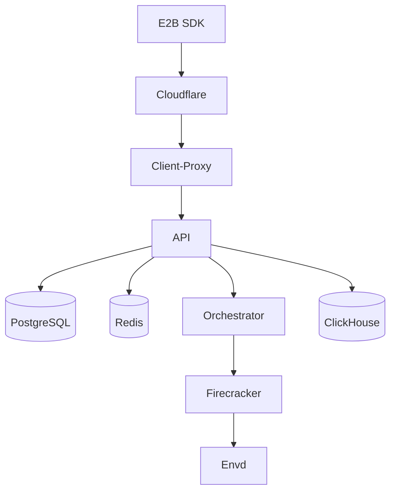
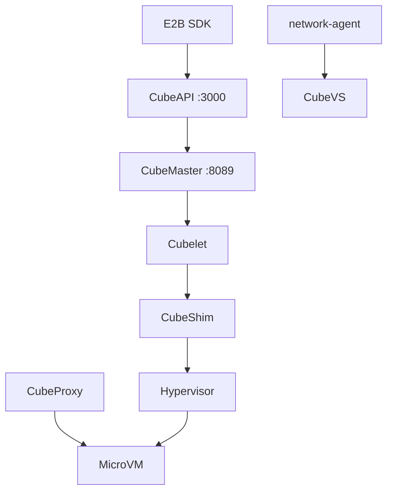

# 02 — 架构对比

## 请求路径

### E2B Infrastructure

- **Nomad + Consul** 调度与服务发现
- **Orchestrator** 在专用节点池以 system Job 运行
- 模板/内核在对象存储；GCP 可用 NFS/Filestore 做 chunk 缓存
- 可观测性：OTEL、Loki、Mimir 等

### CubeSandbox

- **无 Nomad**，控制面为 CubeMaster + 主机进程
- **CubeProxy** 按 Host 头 `<port>-<sandbox_id>.<domain>` 转发
- **CubeVS** 在内核 eBPF 层做策略，面向单机多租户

---

## 组件映射表

| 能力 | E2B Infra | CubeSandbox |
|------|-----------|-------------|
| 对外 API | `packages/api` | cube-api |
| 调度 | Nomad + orchestrator | CubeMaster |
| 节点代理 | Orchestrator | Cubelet |
| Hypervisor | Firecracker | CubeHypervisor（KVM / KvmPvm） |
| 运行时 Shim | — | CubeShim |
| 来宾内代理 | Envd | cube-agent |
| 边缘 | client-proxy | CubeProxy |
| 服务发现 | Consul | `/internal/meta` |
| 网络策略 | netlink/iptables | CubeVS + network-agent |
| 数据库 | PostgreSQL | MySQL |
| 模板构建 | template-manager | `cubemastercli tpl` |
| IaC | Terraform + Packer | one-click 脚本 |

---

## 虚拟化

**Firecracker（E2B）**：需宿主机 KVM → 通常裸金属或支持嵌套虚拟化的云实例。

**KVM + CubeHypervisor（Cube）**：

- 原生 KVM：裸金属、部分有 `/dev/kvm` 的云 VM
- **PVM**：云厂商不暴露 VT-x 时，用 `kvm_pvm` + `vmlinux-pvm`（`CUBE_PVM_ENABLE=1`）

---

## CubeVS 网络（摘要）

| 程序 | 挂载点 | 作用 |
|------|--------|------|
| `from_cube` | TAP TC ingress | 出向 SNAT、策略、会话 |
| `from_world` | 宿主机网卡 ingress | 反向 NAT、端口映射 |
| `from_envoy` | cube-dev egress | 覆盖网络 DNAT |

详见 [网络架构](../architecture/network.md)。

---

## 扩展方式

**E2B**：Terraform 扩展 orchestrator / api / build / clickhouse 等节点池。

**Cube**：控制节点 + 多个计算节点（`install-compute.sh`，角色 `compute`，注册到 CubeMaster `:8089`）。

---

## 运维复杂度

| 方面 | E2B | Cube |
|------|-----|------|
| 首次上线 | 数天级 | 分钟～数小时 |
| 组件数量 | 多 Nomad Job | 较少；DB/Proxy 用 Docker |
| 升级 | build-and-upload + Nomad | 替换发布包 |

---

## 延伸阅读

- [03 — CubeSandbox 部署](./03-cubesandbox-deployment-guide.md)
- [04 — E2B 部署](./04-e2b-infra-deployment-guide.md)
- [05 — 运行环境与性能](./05-runtime-environment-performance.md)
