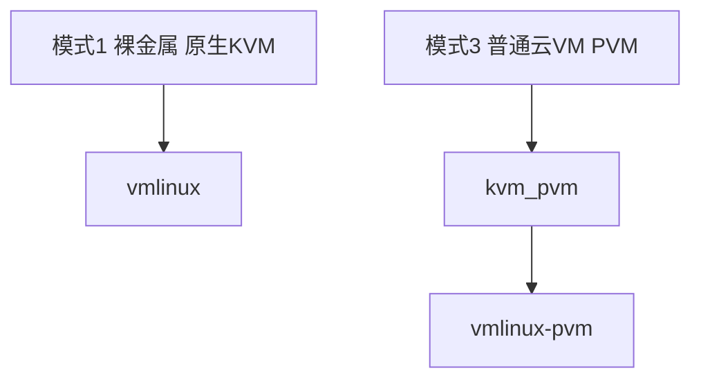

# 05 — 运行环境与性能

说明 **宿主机类型**（裸金属 / 嵌套 KVM / PVM 普通云 VM）对 CubeSandbox 的影响，以及与 E2B 对宿主机的要求对比。

---

## Cube 三种宿主机模式



| 模式 | `/dev/kvm` | 安装 | README 性能数据 |
|------|------------|------|-----------------|
| **1 裸金属** | 硬件 KVM | 默认 | **适用**（60ms 等） |
| **2 嵌套 KVM 云 VM** | 厂商开启时 | 默认 guest | 仓库未单独公布 |
| **3 PVM 云 VM** | `kvm_pvm` | `CUBE_PVM_ENABLE=1` | 生产可靠性有述；**无相对模式1的公开时延表** |

---

## 官方基准（模式 1 — 裸金属）

| 指标 | 数值 |
|------|------|
| 冷启动（1 并发） | 约 **60ms** |
| 冷启动（50 并发） | 平均约 **67ms**，P95 **90ms**，P99 **137ms** |
| 内存开销（规格 ≤32GB） | **&lt;5MB** |
| 密度 | 单机数千（快照 + CoW） |

README 脚注：**启动速度在裸金属环境测试**。模式 3 请将「百毫秒级」作为**待验证目标**，而非承诺。

---

## 分维度影响

### 1. 创建/删除 API 时延

| 因素 | 模式 1 | 模式 3（PVM） |
|------|--------|---------------|
| 页表/VMExit | 低 | 高（影子页表） |
| 宿主机 CPU 抢占 | 小 | 云主机常见 |
| 磁盘 | 本地 NVMe 最佳 | 云盘 IOPS 限制 |
| **结论** | 接近 README 图表 | **P50/P99 通常更差** → 必须压测 |

### 2. 沙箱内 CPU 任务

编译、训练、长时间 Agent 任务：模式 3 常见 **约 5%～25%+** 额外 CPU 开销（视负载而定）。RL/SWE-Bench 等建议 **模式 1**。

### 3. 内存与密度

单沙箱 &lt;5MB 开销模型主要描述 Guest 设计；**单机可承载沙箱总数**在模式 3 通常低于裸金属。

### 4. 网络（CubeVS）

三种模式 CubeVS 行为一致；仍受云厂商带宽、安全组、SNAT 端口池限制。

### 5. 存储

模板导入、CoW 层：建议 `/data/cubelet` 使用高性能独立盘。

---

## PVM 简述

- **问题**：普通云服务器无 host 级 `/dev/kvm`（未开放嵌套虚拟化）。
- **方案**：OpenCloudOS PVM 宿主机内核 + `kvm_pvm` + guest `vmlinux-pvm`。
- **代价**：相对模式 1 多一层虚拟化开销。
- **文档**：[PVM 部署](../guide/pvm-deploy.md)；论文见 ACM PVM 影子页表。

腾讯云文档称 PVM 已在生产大规模使用，强调**可靠性**，不等于等于裸金属峰值性能。

---

## 与 E2B 宿主机要求对比

| | Cube 模式1 | Cube 模式3 PVM | E2B orchestrator 池 |
|--|------------|----------------|---------------------|
| 宿主机 | 裸金属/云裸金属 | 标准 CVM | 裸金属/嵌套 virt |
| VMM | CubeHypervisor | KvmPvm | Firecracker |
| 无 KVM 的云 VM | 否 | **是** | 否 |
| 宣传冷启动 | ~60ms（BM） | 未公布 | 资源池（秒级类） |

---

## 压测方法

```bash
export E2B_API_URL=http://<host>:3000
export E2B_API_KEY=dummy
export CUBE_TEMPLATE_ID=<模板ID>

cd examples/cube-bench && make
./bin/cube-bench -c 20 -n 200 -o report.json
```

在同一模板、同一并发下对比 **裸金属** 与 **PVM 同规格云主机** 的 P50/P95/P99 与错误率。

---

## 场景建议

| 场景 | 推荐模式 |
|------|----------|
| 普通云 CVM、无 KVM | **模式 3** + `CUBE_PVM_ENABLE=1` |
| 自建物理机 | **模式 1** |
| 轻量 Agent 生产 | 模式 3 可接受（压测后）；SLA 高则模式 1 |
| 高并发创建 | **模式 1** + cube-bench |
| RL/重 CPU | **避免仅模式 3** |
| 笔记本开发 | `dev-env`，非模式 3 生产 |

---

## 规格参考（示意）

| 负载 | 模式 | 配置提示 |
|------|------|----------|
| POC | 3 | 4C8G |
| 生产 Agent（轻） | 3 或 1 | 8C16G+，独立数据盘 |
| 高 QPS 创建 | 1 | 裸金属 + 压测 |
| 最大密度 | 1 | 大内存 + 快盘，实测上限 |

---

## 常见误区

| 误区 | 后果 |
|------|------|
| 云 VM 未开 PVM 却用普通 guest | KVM 不可用 |
| `.env` 里 `CUBE_PVM_ENABLE=0` | PVM 静默未启用 |
| 2C 突发型期待 60ms | SLA 预期错误 |
| 未压测即承诺 P99 | 上线后抖动 |

---

## 相关文档

- [03 — 部署指南](./03-cubesandbox-deployment-guide.md)
- [裸金属部署](../guide/bare-metal-deploy.md)
- [PVM 部署](../guide/pvm-deploy.md)
