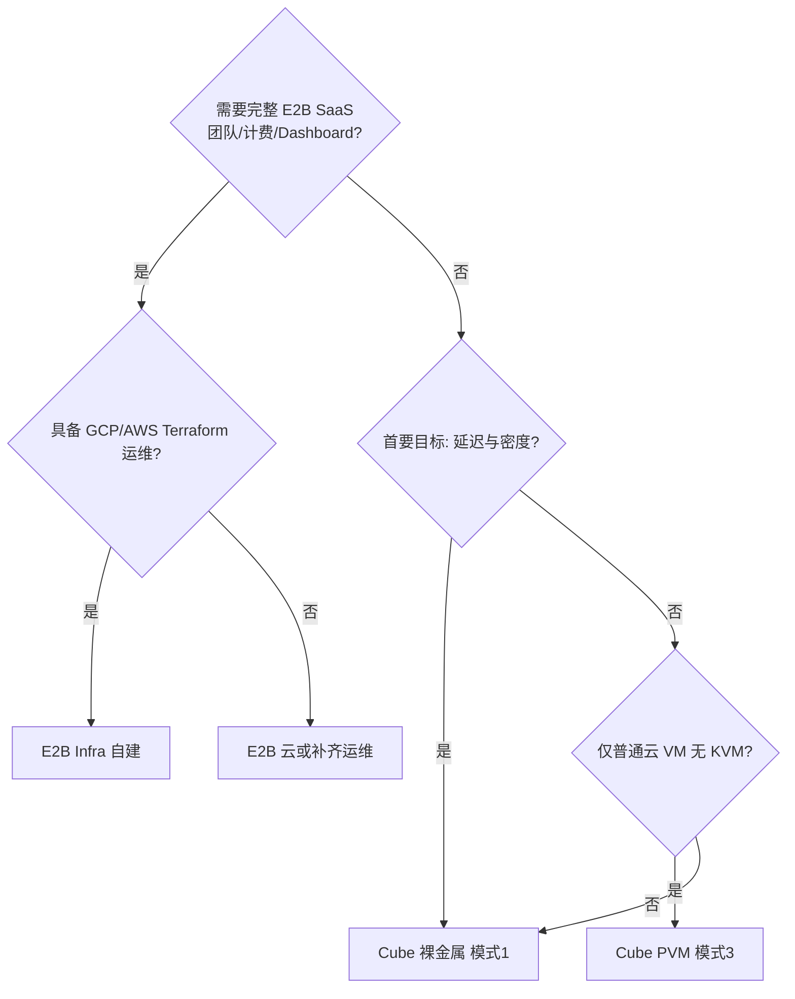

# 06 — 选型、迁移与共存

帮助团队在 **CubeSandbox**、**E2B Infrastructure 自建** 与 **E2B 云服务** 之间决策，并说明 E2B SDK 迁移方式。

---

## 决策流程



---

## 选型矩阵

| 你的优先级 | 建议 |
|------------|------|
| 最快私有化 + E2B SDK | **CubeSandbox** 一键 |
| 只有普通云主机 | **Cube PVM** |
| 对齐 e2b.dev 产品与数据分析 | **E2B Infra** |
| 百毫秒级创建 SLA | **Cube 裸金属** + cube-bench 证明 |
| 运维组件最少 | **Cube 单机** |
| 已有 Nomad/Terraform 体系 | **E2B Infra** |
| 零运维 | **E2B Cloud** |

---

## Cube vs E2B 自建

| 标准 | 选 Cube | 选 E2B Infra |
|------|---------|--------------|
| 首沙箱时间分钟级 | ✓ | |
| 单机/边缘 | ✓ | |
| PVM 普通云 VM | ✓ | |
| Firecracker 生态 | | ✓ |
| Postgres/Supabase 故事 | | ✓ |
| ClickHouse 内置分析 | | ✓ |
| 裸金属毫秒创建宣传 | ✓ | |

---

## 迁移：E2B Cloud → CubeSandbox

1. 按 [03 — 部署指南](./03-cubesandbox-deployment-guide.md) 安装 Cube。
2. 在 Cube 上**重新构建模板**（模板 ID 不互通）。
3. 修改客户端环境变量：

```bash
export E2B_API_URL=http://<cube-host>:3000
export E2B_API_KEY=dummy   # 或正式密钥
export CUBE_TEMPLATE_ID=<新模板ID>
export SSL_CERT_FILE=/path/to/mkcert-rootCA.pem
```

4. 跑集成测试；若关心 SLA，执行 [05 — 性能](./05-runtime-environment-performance.md) 中的 cube-bench。

**通常无需改 Agent 业务代码**（使用官方 E2B SDK 时）。

**不会自动迁移**：E2B 用户/团队库、历史 ClickHouse 数据、Envd 特有行为需单独处理。

---

## 迁移：CubeSandbox → E2B Infra

1. 按 [04 — E2B 部署](./04-e2b-infra-deployment-guide.md) 建站。
2. `make prep-cluster`，在 E2B 流水线构建模板。
3. SDK 改用 `E2B_DOMAIN` 与正式 API Key。
4. 验证沙箱 URL 规则差异（`cube.app` vs 你的 E2B 域名）。

---

## 迁移：裸金属 ↔ PVM 云主机

**上云（改 PVM）**：装 PVM 内核 → `CUBE_PVM_ENABLE=1` → 重测 cube-bench → 调整规格/SLA。

**下云（改裸金属）**：新机器标准安装（无 PVM）→ 迁移 MySQL/切换 `E2B_API_URL`。

---

## 双栈共存

| 模式 | 用途 |
|------|------|
| 开发 Cube、生产 E2B Cloud | 成本与速度 |
| 两套集群服务不同租户 | 需维护两套模板与监控 |
| e2b-dev-sidecar | 本机连远程 Cube，见 [连接已有集群](../guide/connect-existing-cluster.md) |

避免同一业务环境无路由地混用两个 API 端点。

---

## 风险清单

| 风险 | 缓解 |
|------|------|
| 认为 PVM = 裸金属延迟 | 目标规格压测 |
| E2B orchestrator 跑在无 KVM 的 VM | 换实例类型或改用 Cube PVM |
| 生产仍用 `dummy` Key | 启用鉴权 |
| `/data/cubelet` 与系统盘共用 | 独立高性能盘 |

---

## 文档导航

| 问题 | 阅读 |
|------|------|
| 两个产品是什么？ | [01](./01-comparison-overview.md) |
| 组件如何对应？ | [02](./02-architecture-comparison.md) |
| 如何装 Cube？ | [03](./03-cubesandbox-deployment-guide.md) |
| 如何装 E2B？ | [04](./04-e2b-infra-deployment-guide.md) |
| 云 VM 性能够吗？ | [05](./05-runtime-environment-performance.md) |
| 我们选哪个？ | 本文 |
| 机房自建 + 会 K8s？ | [07](./07-on-prem-and-kubernetes.md) |
