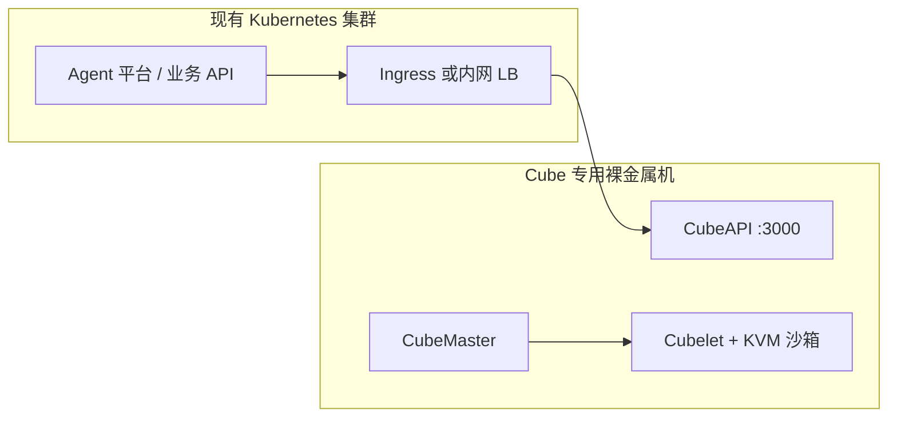

# 07 — 机房自建与 Kubernetes 经验选型

面向 **熟悉 Kubernetes**、计划在 **自建机房**（裸金属或机架服务器）部署沙箱的团队。

---

## 结论（直接回答）

**优先选择 CubeSandbox，在裸金属上使用原生 KVM（模式 1）。**

只有在必须复刻 **完整 E2B 云产品**（团队、计费、Dashboard、ClickHouse 分析链、Firecracker 技术栈），且愿意长期运维 **Nomad 集群** 并做好机房版改造时，再考虑 E2B Infrastructure。

对「有机房、会 K8s」的团队，**Cube 通常更贴地气、上线更快、外部依赖更少**——并不是因为 K8s 经验能直接套到 E2B 上。

---

## 为什么「会 K8s」不等于该选 E2B Infra

| 维度 | E2B Infrastructure | CubeSandbox |
|------|-------------------|-------------|
| **编排** | Nomad + Consul（不是 Kubernetes） | CubeMaster + 主机进程；**无官方 K8s/Helm 生产方案** |
| **默认 IaC** | Terraform，面向 **GCP/AWS** | 脚本 / 离线包，适合机房 |
| **强依赖** | Cloudflare、托管 Postgres（文档偏 Supabase）等 | MySQL/Redis 可在机房 Docker 内完成 |
| **计算节点** | Firecracker，需 **KVM / 裸金属级** 主机 | 物理机或裸金属 + `/dev/kvm` |
| **中小规模机房** | 多节点池、组件多 | 单机可跑，再扩计算节点 |

K8s 经验有助于理解控制面、数据面、调度，但 E2B 自建 **不会** 沿用 `kubectl` 工作流；需要学习 Nomad，并把云上 Terraform 改成机房版（对象存储、数据库、证书、无 Cloudflare 等），投入较大。

---

## 为什么机房场景更适合 CubeSandbox

1. **机架多为裸金属或独占 KVM**  
   一般 **不需要 PVM**（普通云 VM 路径）。模式 1 才有机会接近 README 中的 **~60ms 级创建**（须在自有硬件上用 `cube-bench` 实测）。

2. **依赖可全部落在机房内网**  
   cube-api、CubeMaster、Cubelet、MySQL、Redis、CubeProxy 均可自建，**不必**绑定 Cloudflare 或公有云密钥服务。

3. **与 Agent 集成成本低**  
   E2B SDK 将 `E2B_API_URL` 指向机房内 CubeAPI（`:3000`）即可，业务代码改动通常很小。

4. **扩展路径清晰**  
   先 **单机 All-in-One** → 再 **加计算节点**（`install-compute.sh`），思路类似「先单集群、再加 worker」，只是沙箱运行时不由 K8s 管理。

---

## 与 Kubernetes 经验如何配合（实话）

两套产品 **默认都不是 `helm install` 即可的生产沙箱方案**。MicroVM 依赖 **宿主机 KVM + Cubelet**，一般无法像普通 Deployment 那样跑在无特权 Pod 里。

机房内较合理的分工：

| 层级 | 部署位置 | 运维工具 |
|------|----------|----------|
| **调用方**（Agent、网关、业务服务） | Kubernetes | kubectl、Helm 等 |
| **沙箱运行时**（Cubelet、Hypervisor、CubeVS） | 专用裸金属机 | Cube 一键 / 离线包 |
| **对接** | K8s 内 Service → CubeAPI `:3000` | 集群 DNS、NetworkPolicy |

若硬性要求是 **「所有组件必须进 K8s」**，目前两家都 **没有** 成熟的官方机房 K8s 蓝图，需自研 Chart/Operator（工作量大）。**选 E2B 并不能解决这一点。**

---

## 何时仍选 E2B Infrastructure

仅在 **同时满足多条** 时考虑：

- 产品能力需 **与 e2b.dev 对齐**（不仅是 E2B SDK 跑沙箱）
- 团队愿意长期运维 **Nomad + 多节点池 + ClickHouse + 模板构建链**
- 机房可提供对象存储（如 MinIO）、PostgreSQL、内网 DNS/TLS 等云上能力的替代
- 明确采用 **Firecracker** 技术路线

否则，机房自建场景下 **CubeSandbox 的投入产出比通常更高**。

---

## 建议落地路径（机房）

| 阶段 | 动作 |
|------|------|
| **1 — 试点** | 1～2 台裸金属，`/dev/kvm` 可用；[裸金属部署](../guide/bare-metal-deploy.md) 或 [本地构建部署](../guide/self-build-deploy.md)；建模板；E2B SDK 冒烟 |
| **2 — 证明 SLA** | 使用 [`examples/cube-bench`](https://github.com/tencentcloud/CubeSandbox/tree/master/examples/cube-bench) 压测；记录创建 P50/P95/P99 与单机沙箱密度上限 |
| **3 — 扩展** | [多机集群](../guide/multi-node-deploy.md) 增加计算节点；K8s 内 Agent 通过内网访问 CubeAPI |
| **4 — 加固** | [鉴权](../guide/authentication.md)、[HTTPS/域名](../guide/https-and-domain.md)、MySQL 备份、对接现有 Prometheus/Grafana |

### 硬件建议（起步）

| 项 | 建议 |
|----|------|
| 架构 | x86_64 |
| CPU | 生产 ≥8 核（实验 ≥4 核） |
| 内存 | 生产 ≥16GB（实验 ≥8GB） |
| 虚拟化 | `/dev/kvm`；使用 **模式 1**，非 PVM |
| 磁盘 | 系统盘 ≥50GB；**`/data/cubelet` 独立盘（建议 XFS）** |
| 系统 | OpenCloudOS 9 或 Ubuntu 22.04+ |

---

## 决策速查

| 你的情况 | 选择 |
|----------|------|
| 机房 + Agent 沙箱 + E2B SDK | **CubeSandbox**（裸金属模式 1） |
| 必须自建完整 E2B SaaS + Nomad 运维 | **E2B Infrastructure** |
| 今天就要全部进 Kubernetes | **两家都无开箱方案**；沙箱用专用 Cube 机，调用方放 K8s |
| 机房只有无 KVM 的云风格 VM | 经典机房少见；若无 KVM 才考虑 **PVM** |

**一句话：** 机房自建且熟悉 K8s 时，**沙箱用 Cube 裸金属，调用链用 Kubernetes**。

---

## 相关文档

- [01 — 对比总览](./01-comparison-overview.md)
- [03 — CubeSandbox 部署指南](./03-cubesandbox-deployment-guide.md)
- [05 — 运行环境与性能](./05-runtime-environment-performance.md)
- [06 — 选型与迁移](./06-selection-and-migration.md)
